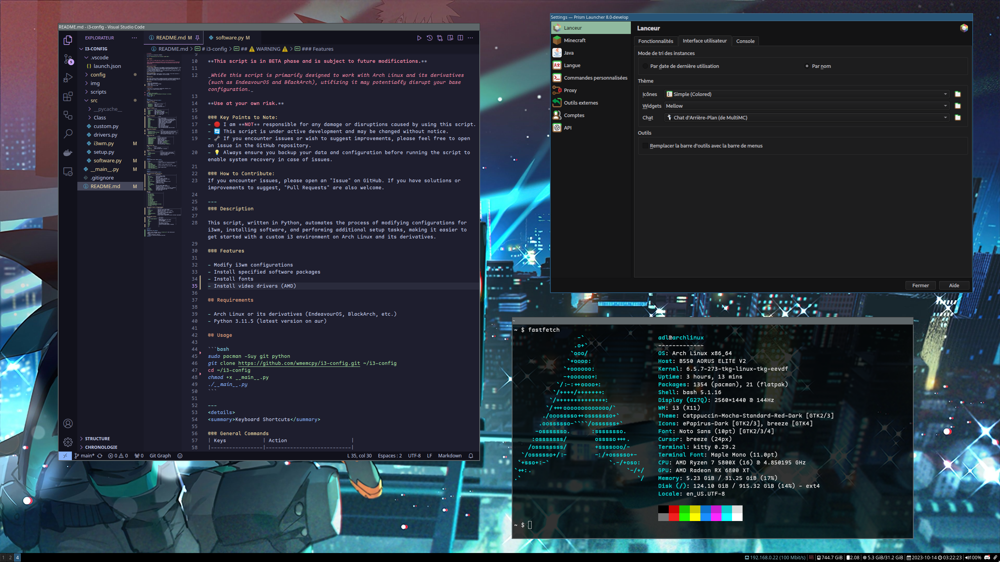
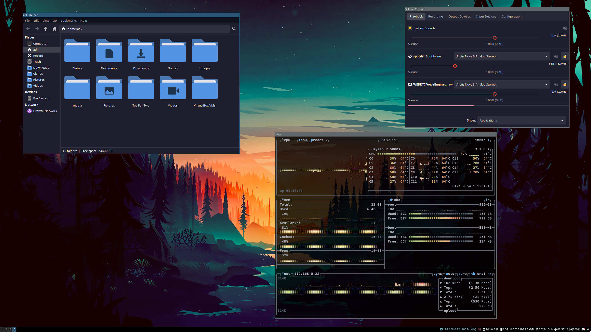

# i3-config

My minimalist i3 configuration (◍•ᴗ•◍)❤ 





---
## ⚠️ WARNING ⚠️

**This script is in BETA phase and is subject to future modifications.**

_While this script is primarily designed to work with Arch Linux and its derivatives (such as EndeavourOS and BlackArch), utilizing it may potentially disrupt your base configuration._

**Use at your own risk.**

### Key Points to Note:
- 🛑 I am **NOT** responsible for any damage or disruptions caused by using this script.
- 🔄 This script is under active development and may be changed without notice.
- 🔧 If you encounter issues or wish to suggest improvements, please feel free to open an issue in the GitHub repository.
- 💡 Always ensure you backup your data and configuration before running the script to enable system recovery in case of issues.

### How to Contribute:
If you encounter issues, please open an "Issue" on GitHub. If you have solutions or improvements to suggest, "Pull Requests" are also welcome.

---
### Description

This script, written in Python, automates the process of modifying configurations for i3wm, installing software, and performing additional setup tasks, making it easier to get started with a custom i3 environment on Arch Linux and its derivatives.

### Features

- Modify i3wm configurations
- Install specified software packages
- Install fonts
- Install video drivers (AMD)

## Requirements

- Arch Linux or its derivatives (EndeavourOS, BlackArch, etc.)
- Python 3.11.5 (latest version on aur)

## Usage

```bash
sudo pacman -Suy git python
git clone https://github.com/wmemcpy/i3-config.git ~/i3-config
cd ~/i3-config
chmod +x __main__.py
./__main__.py
```

---
<details>
<summary>Keyboard Shortcuts</summary>

### General Commands
| Keys            | Action                     |
|-----------------|----------------------------|
| `$mod+Return`   | Open terminal (kitty)      |
| `$mod+Shift+e`  | Exit i3                    |
| `$mod+Shift+r`  | Restart i3 in-place        |
| `$mod+Shift+c`  | Reload configuration file  |

### Launch Commands
| Keys            | Action                             |
|-----------------|------------------------------------|
| `$mod+Shift+p`  | Open `pavucontrol`                 |
| `$mod+c`        | Launch Visual Studio Code          |
| `$mod+b`        | Open Thunar file manager           |
| `$mod+o`        | Open application launcher (`rofi`) |
| `$mod+p`        | Show `rofi` in drun mode           |
| `$mod+x`        | Show `rofi` power menu             |

### Window Management
| Keys                      | Action                                       |
|---------------------------|----------------------------------------------|
| `$mod+q`                  | Kill focused window                          |
| `$mod+space`              | Toggle tiling/floating for focused window    |
| `$mod+Shift+space`        | Change focus between tiling/floating windows |
| `$mod+f`                  | Toggle fullscreen for focused container      |
| `$mod+s`                  | Change container layout to stacked           |
| `$mod+w`                  | Change container layout to tabbed            |
| `$mod+e`                  | Toggle split layout orientation              |
| `$mod+h`                  | Split horizontally                           |
| `$mod+v`                  | Split vertically                             |
| `$mod+r`                  | Enter resize mode                            |
| `$mod+a`                  | Focus the parent container                   |
| `$mod+j/l/k/;`            | Focus left/up/down/right                     |
| `$mod+Left/Down/Up/Right` | Focus left/down/up/right using arrow keys    |

### Workspace Management
| Keys                            | Action                                     |
|---------------------------------|--------------------------------------------|
| `$mod+Shift+j/l/k/;`            | Move focused window left/up/down/right     |
| `$mod+Shift+Left/Down/Up/Right` | Move window left/down/up/right with arrows |
| `$mod+1/2/3/.../0`              | Switch to workspace 1/2/3/.../10           |
| `$mod+Shift+1/2/3/.../0`        | Move container to workspace 1/2/3/.../10   |

### Multimedia Keys
| Keys                    | Action                                  |
|-------------------------|-----------------------------------------|
| `XF86AudioRaiseVolume`  | Increase volume by 10%                  |
| `XF86AudioLowerVolume`  | Decrease volume by 10%                  |
| `XF86AudioMute`         | Toggle audio mute                       |
| `XF86AudioMicMute`      | Toggle microphone mute                  |
| `XF86AudioPlay`         | Play-pause media (`playerctl`)          |
| `XF86AudioPause`        | Pause media (`playerctl`)               |
| `XF86AudioStop`         | Stop media (`playerctl`)                |
| `XF86AudioNext`         | Play next media (`playerctl`)           |
| `XF86AudioPrev`         | Play previous media (`playerctl`)       |

### Screenshot Keys
| Keys           | Action                             |
|----------------|------------------------------------|
| `Print`        | Take a screenshot                  |
| `$mod+Print`   | Select area and take a screenshot  |

### Resize Mode Keys
| Keys                           | Action                              |
|--------------------------------|-------------------------------------|
| `j/l/k/;`                      | Shrink/grow window's width/height   |
| `Left/Down/Up/Right`           | Shrink/grow window using arrow keys |
| `Return`                       | Return to default mode              |
| `Escape`                       | Escape resize mode                  |

</details>


<details>
<summary>Video Drivers (AMD)</summary>

| Package                   | Description                                   |
|---------------------------|-----------------------------------------------|
| `mesa`                    | Graphics library for rendering 3D graphics    |
| `lib32-mesa`              | |
| `vulkan-radeon`           | Radeon's Vulkan graphics API driver           |
| `lib32-vulkan-radeon`     | |
| `vulkan-icd-loader`       | Vulkan Installable Client Driver (ICD) Loader |
| `lib32-vulkan-icd-loader` | |
| `vulkan-mesa-layers`      | Mesa's Vulkan layers                          |
| `lib32-vulkan-mesa-layers`| |

</details>

<details>
<summary>Installed Packages</summary>

### Essential Build Tools and Utilities
| Package             | Description                                        |
|---------------------|----------------------------------------------------|
| `git`               | Version control system                             |
| `base-devel`        | Basic development tools                            |
| `yay` or `paru`     | AUR helper                                         |
| `unzip`             | Utility to unpack .zip files                       |
| `zip`               | Utility to pack and compress files                 |
| `xorg-xrandr`       | Edit screen resolution                             |
| `feh`               | Lightweight image viewer                           |
| `redshift-minimal`  | Adjusts the color temperature of the               |
| `picom`             | Compositor for X11                                 |
| `polkit`            | Authorization manager                              |
| `polkit-gnome`      | |
| `polkit-kde-agent`  | |
| `viewnior`          | Fast and simple image viewer                       |
| `bat`               | Cat clone with syntax highlighting                 |
| `maim`              | Screenshot utility                                 |
| `xclip`             | Command line interface to X selections (clipboard) |
| `nitrogen`          | Background browser and setter for X windows        |
| `fastfetch`         | Fast system information tool                       |
| `imagemagick`       | GUI image viewer                                   |

### Fonts
| Package                                 |
|-----------------------------------------|
| `gnu-free-fonts`                        |
| `ttf-roboto-mono`                       |
| `ttf-font-awesome`                      |
| `noto-fonts`                            |
| `ttf-joypixels`                         |
| `ttf-dejavu`                            |
| `ttf-liberation`                        |
| `ttf-inconsolata`                       |
| `ttf-hack-nerd`                         |
| `ttf-fira-code`                         |
| `ttf-jetbrains-mono-nerd`               |
| `ttf-mononoki-nerd`                     |
| `ttf-cascadia-code-nerd`                |
| `ttf-material-design-icons-extended`    |
| `noto-fonts-emoji-flags`                |
| `ttf-maple`                             |

### i3 Window Manager and Related Packages
| Package                 | Description                                                |
|-------------------------|------------------------------------------------------------|
| `i3-wm`                 | Improved tiling window manager                             |
| `i3lock-color`          | Improved screen locker (color version)                     |
| `i3status`              | Status bar for i3wm                                        |
| `i3blocks`              | Define blocks for your i3bar status line                   |
| `kitty`                 | Fast, feature-rich terminal emulator                       |
| `lightdm-gtk-greeter`   | LightDM GTK+ Greeter                                       |
| `lightdm`               | Cross-desktop display manager                              |
| `rofi`                  | Window switcher, application launcher and dmenu replacement|

### Development Software
| Package                    | Description                                |
|----------------------------|--------------------------------------------|
| `visual-studio-code-bin`   | Code editor                                |
| `vim`                      | Highly configurable text editor            |
| `gdb`                      | The GNU Debugger                           |
| `valgrind`                 | Tool for memory leak detection             |
| `clang`                    | |
| `gcc`                      | GNU Compiler Collection                    |
| `cmake`                    | Cross-platform make system                 |
| `make`                     | Utility to maintain groups of programs     |
| `rust`                     | |
| `zig`                      | |
| `go`                       | |

</details>
